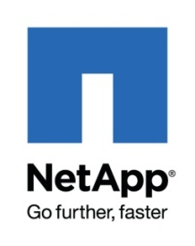
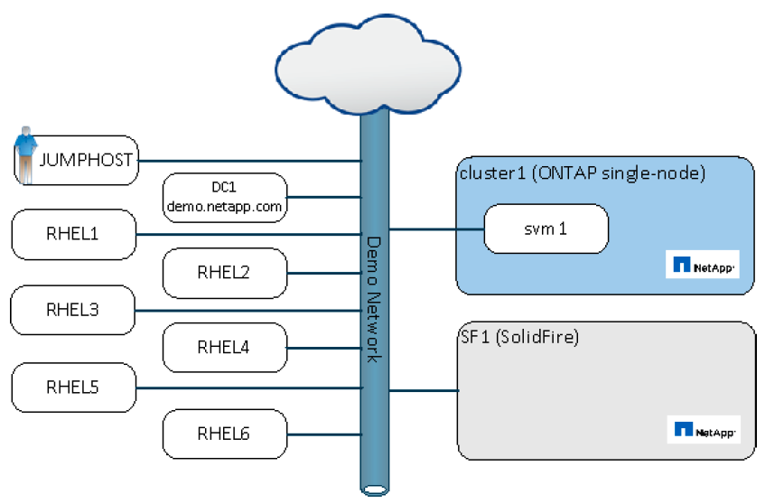
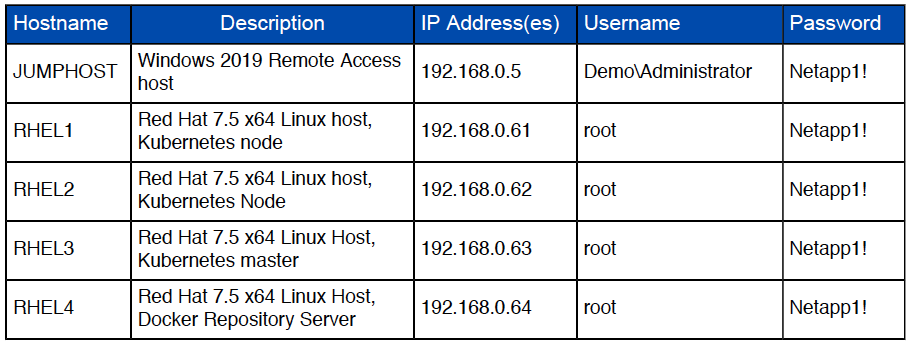
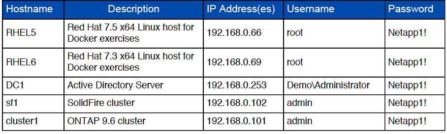
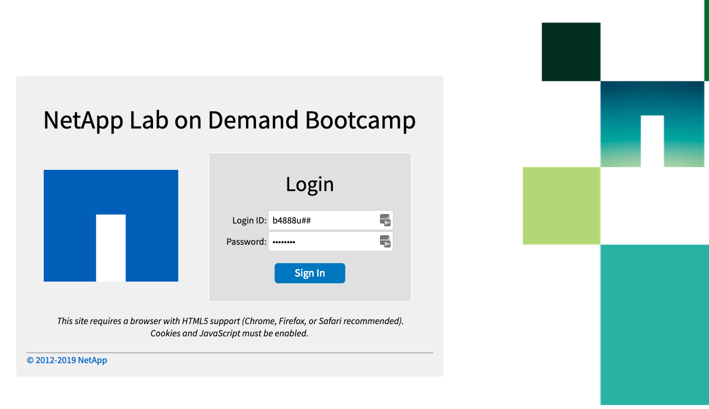
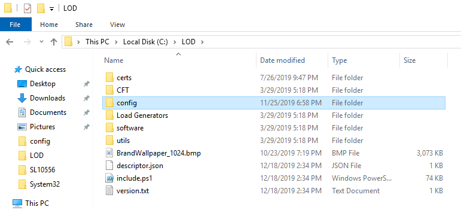
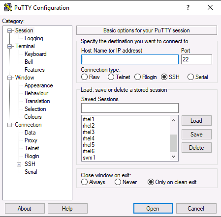
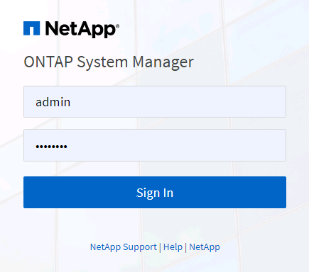

  
  
  
  
  
NETApp University

Introduction to Kubernetes Administration

Lab Guide

Course ID: STRSW-ILT-NKSADM

Catalog Number: TBD

Attention

The information contained in this course is intended only for training.
This course contains information and activities that, while beneficial
for the purposes of training in a closed, non-production environment,
can result in downtime or other severe consequences in a production
environment. This course material is not a technical reference and
should not, under any circumstances, be used in production environments.
To obtain reference materials, refer to the NetApp product documentation
that is located at <http://mysupport.netapp.com/>.

copyright

© 2020 NetApp, Inc. All rights reserved. Printed in the U.S.A.
Specifications subject to change without notice.

No part of this document covered by copyright may be reproduced in any
form or by any means—graphic, electronic, or mechanical, including
photocopying, recording, taping, or storage in an electronic retrieval
system—without prior written permission of NetApp, Inc.

U.S. Government rights

Commercial Computer Software. Government users are subject to the
NetApp, Inc. standard license agreement and applicable provisions of the
FAR and its supplements.

Trademark information

NETAPP, the NETAPP logo, and the marks listed at
<http://www.netapp.com/TM> are trademarks of NetApp, Inc. Other company
and product names may be trademarks of their respective owners.

Table of Contents

INTRODUCTION E0

Module 1 E1

Module 2 E2

Module 3 E3

Module 4 E4

Module 5 E5

Module 6 E6

Module 7 E7

Module 8 E8

Module 9 E9

Module 0: Checking Lab equipment

## Study Aid Icons

In your exercises, you might see one or more of the following icons.

<table>
<thead>
<tr class="header">
<th></th>
<th>
<strong>Warning</strong>

If you misconfigure a step marked with this icon, later steps might not work properly. Check the step carefully before you move forward.
</th>
</tr>
</thead>
<tbody>
<tr class="odd">
<td></td>
<td>
<strong>Attention</strong>

Review this step or comment carefully to save time, learn a best practice, or avoid errors.
</td>
</tr>
<tr class="even">
<td></td>
<td>
<strong>Information</strong>

A comment labeled with this icon provides information about the topic or procedure.
</td>
</tr>
<tr class="odd">
<td></td>
<td>
<strong>References</strong>

A comment labeled with this icon identifies reference material that provides additional information.
</td>
</tr>
</tbody>
</table>

## Checking the Lab Equipment

In this exercise, you familiarize yourself with your equipment and
ensure that the credentials provided by the instructor are operational.

## Objectives

This exercise focuses on enabling you to do the following:

  - > Ensure access to your jump host

  - > Ensure connectivity to an ONTAP cluster

  - > Ensure connectivity to the Element Cluster

  - > Test the access to the Linux VMs and verify that all tools are
    > running properly

## GITHUB Containing the YAML files 

You can download or clone the Github public repositor containing the
necessary YAML files for the labs:
<https://github.com/netapp-devops/course>

## Exercise Equipment Diagram 

Each Lab Kit contains the following Labs:

  - **Modules 1 to 8**: Using Trident with Kubernetes and ONTAP 

  - **Module 9**: Getting Started with NKS on NetApp HCI

  - **Optional**: Use Cloud Manager to Move Kubernetes Application
    Workloads Between Hybrid-Cloud Endpoints

## 

**IMPORTANT: SELECT THE LAB Using Trident with Kubernetes and ONTAP **

## 

## 

##   

## Task 1: Ensure Connectivity to Your ONTAP AND ELEMENT ClusterS

In this task, you familiarize yourself with the Lab on Demand kit
provided by your instructor. You ensure connectivity to the ONTAP
cluster and verify the health of the ONTAP cluster.

<table>
<thead>
<tr class="header">
<th>Step</th>
<th>Action</th>
</tr>
</thead>
<tbody>
<tr class="odd">
<td><ol type="1">
<li></li>
</ol></td>
<td>
Open a browser and visit the following Website:

<a href="https://lod-bootcamp.netapp.com/">https://lod-bootcamp.netapp.com</a>
</td>
</tr>
<tr class="even">
<td><ol start="2" type="1">
<li></li>
</ol></td>
<td>
At the login prompt, enter the credentials provided to you by your instructor:

<strong>Login ID</strong>: bXXXXu[YOUR KIT]

<strong>Password</strong>: ask the instructor

</td>
</tr>
<tr class="odd">
<td><ol start="3" type="1">
<li></li>
</ol></td>
<td>Select the Lab called “<strong>Using Trident with Kubernetes and ONTAP</strong>” and connect to it.</td>
</tr>
<tr class="even">
<td><ol start="4" type="1">
<li></li>
</ol></td>
<td>Once you see the Windows Desktop (your jump host), verify that you have a file called “Stateful Cmds.txt” on the Desktop.</td>
</tr>
<tr class="odd">
<td><ol start="5" type="1">
<li></li>
</ol></td>
<td>Make sure your keyboard is set to the correct layout.</td>
</tr>
<tr class="even">
<td><ol start="6" type="1">
<li></li>
</ol></td>
<td>
Open the C:/LOD folder and make sure you see the config folder:

</td>
</tr>
<tr class="odd">
<td><ol start="7" type="1">
<li></li>
</ol></td>
<td>
On the menu bar, click the Putty icon and verify that you can see 6 RHEL hosts:

</td>
</tr>
<tr class="even">
<td><ol start="8" type="1">
<li></li>
</ol></td>
<td>
In Putty, double click the “cluster1” session and login to the ONTAP cluster:

Username: admin

Password: Netapp1!
</td>
</tr>
<tr class="odd">
<td><ol start="9" type="1">
<li></li>
</ol></td>
<td>Enter the command “date” and verify that the time is synchronized.</td>
</tr>
<tr class="even">
<td><ol start="10" type="1">
<li></li>
</ol></td>
<td>Open a web browser and navigate to cluster1.demo.netapp.com.</td>
</tr>
<tr class="odd">
<td><ol start="11" type="1">
<li></li>
</ol></td>
<td>
Login using the credentials in step 1-8 and navigate your cluster:

</td>
</tr>
</tbody>
</table>

## 

## Task 2: Verify That Required SOFTWARE AND TOOLS ARE Installed

The RHEL hosts must have several tools running, including Docker and
Kubernetes.

<table>
<thead>
<tr class="header">
<th>Step</th>
<th>Action</th>
</tr>
</thead>
<tbody>
<tr class="odd">
<td><ol type="1">
<li></li>
</ol></td>
<td>
Open the Putty Client and double click on the rhel5 session:

</td>
</tr>
<tr class="even">
<td><ol start="2" type="1">
<li></li>
</ol></td>
<td>
Login using the credentials:

Username: root

Password: Netapp1!
</td>
</tr>
<tr class="odd">
<td><ol start="3" type="1">
<li></li>
</ol></td>
<td>
Run the following command to verify that the docker daemon is running:

<strong>ps -aef | grep dockerd</strong>
</td>
</tr>
<tr class="even">
<td><ol start="4" type="1">
<li></li>
</ol></td>
<td>
Verify if containers are running:

<strong>docker ps</strong>
</td>
</tr>
<tr class="odd">
<td><ol start="5" type="1">
<li></li>
</ol></td>
<td>
Verify the connection to the public Docker repositories:

<strong>docker search netapp</strong>
</td>
</tr>
<tr class="even">
<td><ol start="6" type="1">
<li></li>
</ol></td>
<td>
Run a Docker container and destroy it:

<strong>docker run -it debian</strong>

<strong>ls -al</strong>

<strong>exit</strong>

<strong>docker ps</strong>

<strong>docker ps -a</strong> (to list stopped containers)

<strong>docker rm $(docker ps -a -q)</strong> (to delete ALL stopped containers)
</td>
</tr>
<tr class="odd">
<td><ol start="7" type="1">
<li></li>
</ol></td>
<td>
Verify that the docker0 interface is configured on the host:

<strong>ifconfig docker0</strong>
</td>
</tr>
<tr class="even">
<td><ol start="8" type="1">
<li></li>
</ol></td>
<td>
Optionally, create an alias for the docker command (makes recurrent commands faster):

<strong>alias d=’docker’</strong>
</td>
</tr>
<tr class="odd">
<td><ol start="9" type="1">
<li></li>
</ol></td>
<td>
Close the putty session and open a new one on rhel3 (master node of the Kubernetes cluster):

</td>
</tr>
<tr class="even">
<td><ol start="10" type="1">
<li></li>
</ol></td>
<td>
Login using the credentials:

Username: <strong>root</strong>

Password: <strong>Netapp1!</strong>
</td>
</tr>
<tr class="odd">
<td><ol start="11" type="1">
<li></li>
</ol></td>
<td>
Verify that the Kubernetes services are running:

<strong>ps -aux | grep kubernetes</strong>
</td>
</tr>
<tr class="even">
<td><ol start="12" type="1">
<li></li>
</ol></td>
<td>
Optionally, create an alias for the most utilized Kubernetes command:

<strong>alias k=’kubectl’</strong>

Note: If you use the alias, you can replace all the upcoming “kubectl” commands with “k”.
</td>
</tr>
<tr class="odd">
<td><ol start="13" type="1">
<li></li>
</ol></td>
<td>
Verify the version of Kubernetes:

<strong>k version</strong>
</td>
</tr>
<tr class="even">
<td><ol start="14" type="1">
<li></li>
</ol></td>
<td>
Verify the node type you connected to:

<strong>k cluster-info</strong>
</td>
</tr>
<tr class="odd">
<td><ol start="15" type="1">
<li></li>
</ol></td>
<td>
Verify that the Kubernetes cluster is showing you the 3 nodes:

<strong>k get nodes</strong>

Use the -o option to change the output (this option can be used in many commands):

<strong>k get nodes -o wide</strong>

<strong>k get nodes -o json</strong>
</td>
</tr>
<tr class="even">
<td><ol start="16" type="1">
<li></li>
</ol></td>
<td>
Label the worker nodes (with the role set to “none”) with a recognizable tag:

<strong>k label node rhel1 node-role.kubernetes.io/worker=</strong>

<strong>k label node rhel2 node-role.kubernetes.io/worker=</strong>
</td>
</tr>
<tr class="odd">
<td><ol start="17" type="1">
<li></li>
</ol></td>
<td>
Verify that the Kubernetes nodes are showing the right labels:

<strong>k get nodes</strong>
</td>
</tr>
<tr class="even">
<td><ol start="18" type="1">
<li></li>
</ol></td>
<td>
Open the Kubernetes Configuration Files:

<strong>cat $HOME/.kube/config</strong>
</td>
</tr>
<tr class="odd">
<td><ol start="19" type="1">
<li></li>
</ol></td>
<td>
View the Kubernetes Configuration:

<strong>k config view</strong>
</td>
</tr>
<tr class="even">
<td><ol start="20" type="1">
<li></li>
</ol></td>
<td>
Navigate to the root user’s directory:

<strong>cd /root</strong>
</td>
</tr>
<tr class="odd">
<td><ol start="21" type="1">
<li></li>
</ol></td>
<td>
Clone the contents of the NetAppU DevOps git repository and browse the new folder:

<strong>git clone https://github.com/netapp-devops/course/</strong>

<strong>cd course/</strong>

<strong>ls -al</strong>
</td>
</tr>
</tbody>
</table>

End of Exercise
