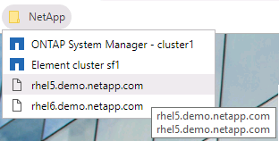
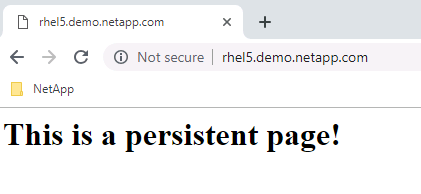

Module 1: Docker

## Objectives

This exercise focuses on enabling you to do the following:

  - > Get familiar with the docker common CLI commands

  - > Modify an existing container

  - > Create your own docker image using dockerfile
    
    **NOTE: All the tasks in the following module are executed on the
    Docker host rhel5 or rhel6.**

## Task 1: Get familiar with the docker common CLI command

In this task, you will explore the docker CLI.

<table>
<thead>
<tr class="header">
<th>Step</th>
<th>Action</th>
</tr>
</thead>
<tbody>
<tr class="odd">
<td><ol type="1">
<li></li>
</ol></td>
<td>
Using Putty, open an SSH connection to rhel5:

</td>
</tr>
<tr class="even">
<td><ol start="2" type="1">
<li></li>
</ol></td>
<td>
Login using the credentials:

Username: root

Password: Netapp1!
</td>
</tr>
<tr class="odd">
<td><ol start="3" type="1">
<li></li>
</ol></td>
<td>
Issue the following command and review the available options:

docker
</td>
</tr>
<tr class="even">
<td><ol start="4" type="1">
<li></li>
</ol></td>
<td>
Now issue the following command and review the available options:

docker container
</td>
</tr>
<tr class="odd">
<td><ol start="5" type="1">
<li></li>
</ol></td>
<td>
Review the running containers:

docker ps
</td>
</tr>
<tr class="even">
<td><ol start="6" type="1">
<li></li>
</ol></td>
<td>
Check the version of docker installed on your system:

docker version

Visit the release notes website to find out about the version you are running:

<a href="https://docs.docker.com/engine/release-notes/">https://docs.docker.com/engine/release-notes/</a>
</td>
</tr>
<tr class="odd">
<td><ol start="7" type="1">
<li></li>
</ol></td>
<td>
Display the detailed information about your instance:

docker info
</td>
</tr>
<tr class="even">
<td><ol start="8" type="1">
<li></li>
</ol></td>
<td>
Verify that no images are present on the system:

docker images
</td>
</tr>
<tr class="odd">
<td><ol start="9" type="1">
<li></li>
</ol></td>
<td>
Run your first ephemeral container:

docker run hello-world
</td>
</tr>
<tr class="even">
<td><ol start="10" type="1">
<li></li>
</ol></td>
<td>
Verify a new image was downloaded for the hello-world container:

docker images
</td>
</tr>
<tr class="odd">
<td><ol start="11" type="1">
<li></li>
</ol></td>
<td>
Run the following command to search for a specific docker image:

docker search httpd
</td>
</tr>
<tr class="even">
<td><ol start="12" type="1">
<li></li>
</ol></td>
<td>
Open the following Website from a browser <a href="https://index.docker.io">https://index.docker.io</a> and search for “httpd”.

Note: index.docker.io is the default repository used by docker to search and download images. It can be viewed using the “docker info” command.
</td>
</tr>
<tr class="odd">
<td><ol start="13" type="1">
<li></li>
</ol></td>
<td>
Download the httpd version 2.2 docker image:

docker pull httpd:2.2
</td>
</tr>
<tr class="even">
<td><ol start="14" type="1">
<li></li>
</ol></td>
<td>
Verify the image downloaded:

docker images
</td>
</tr>
<tr class="odd">
<td><ol start="15" type="1">
<li></li>
</ol></td>
<td>
Start a container using the newly downloaded docker image:

docker run -d --name webserver httpd:2.2

The -d option indicates that the container is to run in detached mode rather than in the foreground, so that you will not tie up your command line session while the container is running.
</td>
</tr>
<tr class="even">
<td><ol start="16" type="1">
<li></li>
</ol></td>
<td>
Verify that your container is running:

docker ps
</td>
</tr>
<tr class="odd">
<td><ol start="17" type="1">
<li></li>
</ol></td>
<td>
Check the logs for your container:

docker logs webserver

Note: you can also use the 3 first digits of the container ID from the docker ps output.
</td>
</tr>
<tr class="even">
<td><ol start="18" type="1">
<li></li>
</ol></td>
<td>
Now open Chrome on the jump host and browse the rhel5 shortcut:

</td>
</tr>
<tr class="odd">
<td><ol start="19" type="1">
<li></li>
</ol></td>
<td>
The following should appear:

</td>
</tr>
<tr class="even">
<td><ol start="20" type="1">
<li></li>
</ol></td>
<td>This is expected behavior, as we did not specify any port mapping between the container and the host, so the container is completely isolated.</td>
</tr>
<tr class="odd">
<td><ol start="21" type="1">
<li></li>
</ol></td>
<td>
Stop and remove the container:

docker stop webserver

docker rm webserver
</td>
</tr>
</tbody>
</table>

## Task 2: modify an existing container

In this task, you will learn how to configure container network ports
and modify the container templates.

<table>
<thead>
<tr class="header">
<th>Step</th>
<th>Action</th>
</tr>
</thead>
<tbody>
<tr class="odd">
<td><ol type="1">
<li></li>
</ol></td>
<td>
Create a new httpd container, this time with a port mapping from the container’s TCP port 80 to the host’s TCP port 80:

docker run -d --name webserver -p 80:80 httpd:2.2
</td>
</tr>
<tr class="even">
<td><ol start="2" type="1">
<li></li>
</ol></td>
<td>
Verify that the container is running, and the port mapping information is displayed:

docker ps
</td>
</tr>
<tr class="odd">
<td><ol start="3" type="1">
<li></li>
</ol></td>
<td>
Open a browser again and visit the rhel5.demo.netapp.com website, or refresh the previous page:

This is the Apache default Webserver page.
</td>
</tr>
<tr class="even">
<td><ol start="4" type="1">
<li></li>
</ol></td>
<td>
Now let’s change the contents displayed by our webserver. We will need to enter the container image’s CLI first:

docker exec -it webserver /bin/bash

Notice the change in the command prompt. The docker exec command runs a command inside a running container. In this example that command is the bash shell, and the combination of the -i and -t options for the exec sub-command indicates that Docker should maintain an interactive tty connection to that bash shell until you explicitly terminate it.
</td>
</tr>
<tr class="odd">
<td><ol start="5" type="1">
<li></li>
</ol></td>
<td>
Navigate to the container's htdoc's directory:

cd /usr/local/apache2/htdocs
</td>
</tr>
<tr class="even">
<td><ol start="6" type="1">
<li></li>
</ol></td>
<td>
Display the directory's contents (you should see the default index.html):

ls -al
</td>
</tr>
<tr class="odd">
<td><ol start="7" type="1">
<li></li>
</ol></td>
<td>
Review the contents of index.html:

cat index.html
</td>
</tr>
<tr class="even">
<td><ol start="8" type="1">
<li></li>
</ol></td>
<td>
Now modify the contents using the following command:

echo '&lt;h1&gt;Welcome to the NetApp Data Fabric!&lt;/h1&gt;' &gt; index.html
</td>
</tr>
<tr class="odd">
<td><ol start="9" type="1">
<li></li>
</ol></td>
<td>
Review the contents of index.html:

cat index.html
</td>
</tr>
<tr class="even">
<td><ol start="10" type="1">
<li></li>
</ol></td>
<td>Open a browser again and visit the rhel5.demo.netapp.com website, or refresh the previous page:</td>
</tr>
<tr class="odd">
<td><ol start="11" type="1">
<li></li>
</ol></td>
<td>
Exit the container and stop it:

exit

docker stop webserver
</td>
</tr>
<tr class="even">
<td><ol start="12" type="1">
<li></li>
</ol></td>
<td>
Refresh the website:

</td>
</tr>
<tr class="odd">
<td><ol start="13" type="1">
<li></li>
</ol></td>
<td>
Start the container:

docker start webserver
</td>
</tr>
<tr class="even">
<td><ol start="14" type="1">
<li></li>
</ol></td>
<td>
Refresh the website:

This time the page displays properly, demonstrating that the content was preserved across restarts of the hosting container.
</td>
</tr>
<tr class="odd">
<td><ol start="15" type="1">
<li></li>
</ol></td>
<td>
Stop and remove the container:

docker stop webserver &amp;&amp; docker rm webserver

Tip: The “&amp;&amp;” syntax in the above command allows you to logically link the execution of two independent commands together. In this example the “docker rm my_www” command will execute only if the “docker stop my_www” completes successfully.
</td>
</tr>
<tr class="even">
<td><ol start="16" type="1">
<li></li>
</ol></td>
<td>Now let’s update the version of our Apache Server container image.</td>
</tr>
<tr class="odd">
<td><ol start="17" type="1">
<li></li>
</ol></td>
<td>
Instantiate a container for the latest httpd:

docker run -d --name webserver -p 80:80 httpd:latest

Since the latest httpd container image is not available locally, Docker initiates an image download operation that once finished, instantiates the container.

Attention: If you get an error message stating “...lookup index.docker.io: no such host” while running this command, try re-issuing the command. This image gets pulled from a public Docker server that has, on occasion, emitted this error, but the error resolves itself when you re-run the command.
</td>
</tr>
<tr class="even">
<td><ol start="18" type="1">
<li></li>
</ol></td>
<td>
Issue the following command to review the new image:

docker images
</td>
</tr>
<tr class="odd">
<td><ol start="19" type="1">
<li></li>
</ol></td>
<td>
Verify that the container is running, and the port mapping information and image version are displayed:

docker ps
</td>
</tr>
<tr class="even">
<td><ol start="20" type="1">
<li></li>
</ol></td>
<td>
Refresh your browser to verify that the new httpd container is running:

</td>
</tr>
<tr class="odd">
<td><ol start="21" type="1">
<li></li>
</ol></td>
<td>
Stop and remove the container:

docker stop webserver &amp;&amp; docker rm webserver
</td>
</tr>
<tr class="even">
<td><ol start="22" type="1">
<li></li>
</ol></td>
<td>
Now create a new Docker local container volume named “webserver” using the local file system driver (it will create that volume on one of rhel5's local disks, outside of any given container's native directory trees) and verify it:

docker volume create --name=webserver

docker volume ls
</td>
</tr>
<tr class="odd">
<td><ol start="23" type="1">
<li></li>
</ol></td>
<td>
Inspect the newly created webserver volume:

docker volume inspect webserver

Notice that the Mountpoint value indicates that this persistent volume maps to the /var/lib/docker/volumes/webserver/_data directory on the container host (i.e., on rhel5).
</td>
</tr>
<tr class="even">
<td><ol start="24" type="1">
<li></li>
</ol></td>
<td>
You have created a persistent volume, but that volume is not currently associated with any container, so it is empty. Create a new “webserver” container that has the “webserver” volume attached as /usr/local/apache2/htdocs (the location of the index file):

docker run -d --name webserver -v webserver:/usr/local/apache2/htdocs -p 80:80 httpd:2.2
</td>
</tr>
<tr class="odd">
<td><ol start="25" type="1">
<li></li>
</ol></td>
<td>
Inspect the “webserver” container you just created and find the “HostConfig” and “Mounts” sections:

docker inspect webserver
</td>
</tr>
<tr class="even">
<td><ol start="26" type="1">
<li></li>
</ol></td>
<td>
Refresh the Chrome browser to display <a href="http://rhel5.demo.netapp.com">http://rhel5.demo.netapp.com</a>:

</td>
</tr>
<tr class="odd">
<td><ol start="27" type="1">
<li></li>
</ol></td>
<td>
Now from RHEL5, display the contents of the Host volume you mapped inside the container:

ls /var/lib/docker/volumes/webserver/_data

Note: This folder is on your Docker Host, but contains files from your container path specified in step 2-7: /usr/local/apache2/htdocs.

Those are, for an Apache Webserver, the index.html file.
</td>
</tr>
<tr class="even">
<td><ol start="28" type="1">
<li></li>
</ol></td>
<td>
Now using the Docker host, let’s change the Webserver’s default file:

echo ‘&lt;h1&gt;This is a persistent page!&lt;/h1&gt;’ &gt; /var/lib/docker/volumes/webserver/_data/index.html
</td>
</tr>
<tr class="odd">
<td><ol start="29" type="1">
<li></li>
</ol></td>
<td>
Refresh Chrome to display the updated Webserver:

</td>
</tr>
<tr class="even">
<td><ol start="30" type="1">
<li></li>
</ol></td>
<td>
Stop and remove the container:

docker stop webserver &amp;&amp; docker rm webserver
</td>
</tr>
<tr class="odd">
<td><ol start="31" type="1">
<li></li>
</ol></td>
<td>
Now from RHEL5, check the contents of your Docker Volume and the index file:

ls /var/lib/docker/volumes/webserver/_data

cat /var/lib/docker/volumes/webserver/_data/index.html
</td>
</tr>
<tr class="even">
<td><ol start="32" type="1">
<li></li>
</ol></td>
<td>
Now let’s create a new webserver container with our persistent configuration:

docker run -d --name webserver -v webserver:/usr/local/apache2/htdocs -p 80:80 httpd:latest
</td>
</tr>
<tr class="odd">
<td><ol start="33" type="1">
<li></li>
</ol></td>
<td>
Refresh Chrome to display the new Webserver:

</td>
</tr>
<tr class="even">
<td><ol start="34" type="1">
<li></li>
</ol></td>
<td>
Cleanup what you have created:

docker stop webserver &amp;&amp; docker rm webserver

docker ps -a

docker volume rm webserver

docker volume ls
</td>
</tr>
</tbody>
</table>

## Task 3: CREATE A new DOCKER CUSTOM IMAGE using the dockerfile

There are two ways to create a custom container image. The first is to
take an existing image, modify it, and then push it into the registry.
The second is to build an image using a Dockerfile, then push it to the
registry.

<table>
<thead>
<tr class="header">
<th>Step</th>
<th>Action</th>
</tr>
</thead>
<tbody>
<tr class="odd">
<td><ol type="1">
<li></li>
</ol></td>
<td>
Using Putty, open an SSH connection to rhel5:

</td>
</tr>
<tr class="even">
<td><ol start="2" type="1">
<li></li>
</ol></td>
<td>
Instantiate the <strong>new</strong> httpd container instance that you will customize:

docker run -d --name my_webserver httpd:latest
</td>
</tr>
<tr class="odd">
<td><ol start="3" type="1">
<li></li>
</ol></td>
<td>
Establish an interactive CLI session into the container:

docker exec -it my_webserver /bin/bash
</td>
</tr>
<tr class="even">
<td><ol start="4" type="1">
<li></li>
</ol></td>
<td>
Create a new index.html file for the container's web server:

echo '&lt;h1&gt;Build your own Data Fabric!&lt;/h1&gt;' &gt; htdocs/index.html
</td>
</tr>
<tr class="odd">
<td><ol start="5" type="1">
<li></li>
</ol></td>
<td>
End the CLI session:

exit
</td>
</tr>
<tr class="even">
<td><ol start="6" type="1">
<li></li>
</ol></td>
<td>
Verify that the container is still running and then stop it:

docker stop my_webserver
</td>
</tr>
<tr class="odd">
<td><ol start="7" type="1">
<li></li>
</ol></td>
<td>
Display a list of all the containers on the host, including those that are not running:

docker ps -a
</td>
</tr>
<tr class="even">
<td><ol start="8" type="1">
<li></li>
</ol></td>
<td>
Commit the changes you just made to the “my_custom_httpd” image:

docker commit my_webserver registry.demo.netapp.com/my_webserver:latest

When you commit the container, you are preserving its state so that it can be re-used to instantiate other container instances. On a commit operation, Docker creates a new local image, but only stores the differences between the container's source image and the container's current state.
</td>
</tr>
<tr class="odd">
<td><ol start="9" type="1">
<li></li>
</ol></td>
<td>
Generate a list of the local images: docker images

Note the repository name for the newly committed image, “registry.demo.netapp.com/my_webserver_image”. By default, the docker command assumes commits are supposed to go to the main docker hub (hub.docker.com), but this lab exercise utilizes a local docker registry server (registry.demo.netapp.com, which is an alias for rhel4).
</td>
</tr>
<tr class="even">
<td><ol start="10" type="1">
<li></li>
</ol></td>
<td>
Push the new “my_webserver” image to the registry server so that server can offer the image to other users and registry servers:

docker push registry.demo.netapp.com/my_webserver
</td>
</tr>
<tr class="odd">
<td><ol start="11" type="1">
<li></li>
</ol></td>
<td>
Switch to a Putty Session on rhel6:

</td>
</tr>
<tr class="even">
<td><ol start="12" type="1">
<li></li>
</ol></td>
<td>
Pull a copy of the “my_webserver” image from the registry server to the local host:

docker pull registry.demo.netapp.com/my_webserver
</td>
</tr>
<tr class="odd">
<td><ol start="13" type="1">
<li></li>
</ol></td>
<td>
Instantiate a new container from this image:

docker run -d -p 80:80 registry.demo.netapp.com/my_webserver
</td>
</tr>
<tr class="even">
<td><ol start="14" type="1">
<li></li>
</ol></td>
<td>
In Chrome, open the web page for <a href="http://rhel6.demo.netapp.com">http://rhel6.demo.netapp.com</a>:

The web page published by rhel6 matches the customized web page you included in the customized container image you created using rhel5.
</td>
</tr>
<tr class="odd">
<td><ol start="15" type="1">
<li></li>
</ol></td>
<td>
Terminate your container instance using the First 3 digits of the Container ID. You will need the container ID from your lab instance to do it. This can be displayed using the following command:

docker ps

CONTAINER ID IMAGE

<strong>cffee8cc30b8</strong> httpd:latest
</td>
</tr>
<tr class="even">
<td><ol start="16" type="1">
<li></li>
</ol></td>
<td>
Cleanup what you have created (you can use the entire Container ID, or the first 3 digits):

docker stop <strong>cff</strong> &amp;&amp; docker rm <strong>cff</strong>
</td>
</tr>
<tr class="odd">
<td><ol start="17" type="1">
<li></li>
</ol></td>
<td>
Exit rhel6 and go back to rhel5.

Next you will build an image using a Dockerfile. A Dockerfile contains a set of instructions on how to build new images, and the docker build command executes those instructions. Dockerfiles offer a more robust way to build images because they document and automate the build process, which makes it easier to share image development processes among a team.
</td>
</tr>
<tr class="even">
<td><ol start="18" type="1">
<li></li>
</ol></td>
<td>
On rhel5, let’s cerate a temporary folder :

mkdir /tmp/custom

cd /tmp/custom
</td>
</tr>
<tr class="odd">
<td><ol start="19" type="1">
<li></li>
</ol></td>
<td>
Create a new index.html file that you will add to the new image you are creating:

echo '&lt;h1&gt;This is the Docker Fabric!&lt;/h1&gt;' &gt; index.html
</td>
</tr>
<tr class="even">
<td><ol start="20" type="1">
<li></li>
</ol></td>
<td>
Create a Dockerfile that contains instructions for customizing your image and check it:

echo 'FROM httpd:latest' &gt; Dockerfile

echo 'ADD index.html /usr/local/apache2/htdocs/index.html' &gt;&gt; Dockerfile

cat Dockerfile

These instructions indicate that Docker should use the “httpd:latest” image as a starting point, and then install the customized index.html file in the image as /usr/local/apache2/htdocs/index.html.
</td>
</tr>
<tr class="odd">
<td><ol start="21" type="1">
<li></li>
</ol></td>
<td>
Build the customized image:

docker build -t registry.demo.netapp.com/another_webserver /tmp/custom
</td>
</tr>
<tr class="even">
<td><ol start="22" type="1">
<li></li>
</ol></td>
<td>
List the docker images on this host and look for ‘another_webserver’:

docker images
</td>
</tr>
<tr class="odd">
<td><ol start="23" type="1">
<li></li>
</ol></td>
<td>
Start a new container based on that image:

docker run -d -p 80:80 registry.demo.netapp.com/another_webserver
</td>
</tr>
<tr class="even">
<td><ol start="24" type="1">
<li></li>
</ol></td>
<td>
Refresh the Chrome browser to display <a href="http://rhel5.demo.netapp.com">http://rhel5.demo.netapp.com</a>:

</td>
</tr>
<tr class="odd">
<td><ol start="25" type="1">
<li></li>
</ol></td>
<td>
Terminate your container instance using the First 3 digits of the Container ID. You will need the container ID from your lab instance to do it. This can be displayed using the following command:

docker ps

CONTAINER ID IMAGE

<strong>7e972e3969a1</strong> registry.demo.netapp.com/another_webserver
</td>
</tr>
<tr class="even">
<td><ol start="26" type="1">
<li></li>
</ol></td>
<td>
Cleanup what you have created (you can use the entire Container ID, or the first 3 digits):

docker stop <strong>7e9</strong> &amp;&amp; docker rm <strong>7e9</strong>
</td>
</tr>
<tr class="odd">
<td><ol start="27" type="1">
<li></li>
</ol></td>
<td>
Terminate your PuTTY session to rhel5:

exit
</td>
</tr>
<tr class="even">
<td><ol start="28" type="1">
<li></li>
</ol></td>
<td>You can now build your own Docker Images based on available images from Docker.io, or private repositories. If you want to try something more complex, you could deploy an Ansible Server in Docker using the ansible/ansible Dockerfile available here: <a href="https://hub.docker.com/r/ansible/ansible/dockerfile">https://hub.docker.com/r/ansible/ansible/dockerfile</a></td>
</tr>
</tbody>
</table>

End of Exercise
