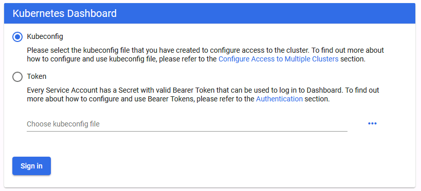
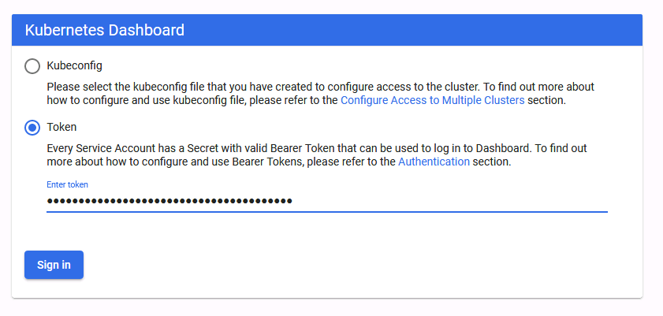
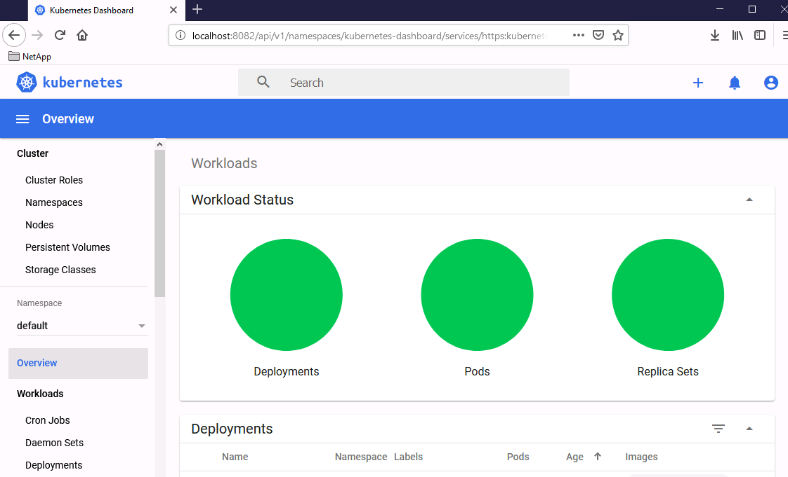
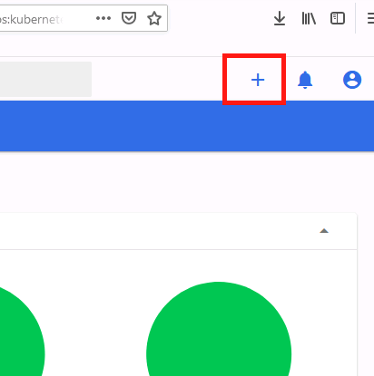
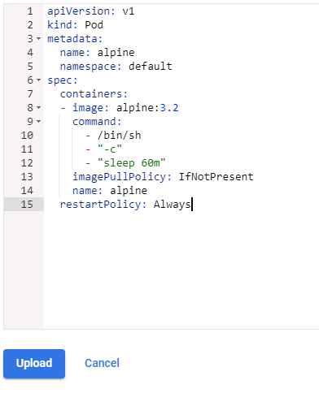
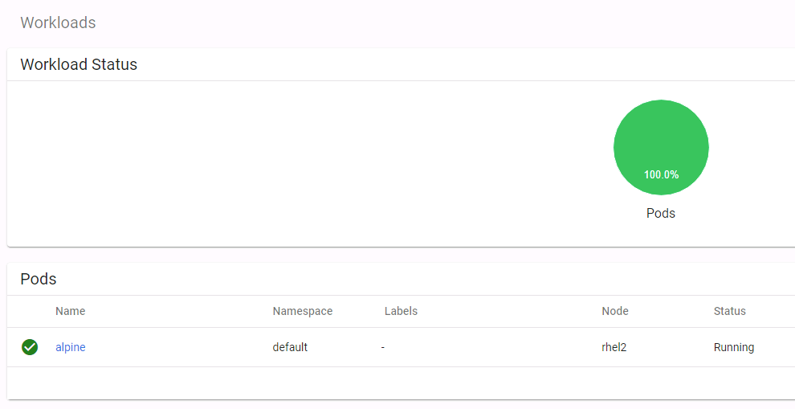

Module 8: Monitoring

## Objectives

This exercise focuses on enabling you to do the following:

  - > Deploy and use the Kubernetes Dashboard

  - > Deploy and use the Metrics Server

  - > Explore Pod Logs in Kubernetes
    
    **NOTE: All the tasks in the following module are executed on the
    Kubernetes Master. You must SSH the rhel3 host in your labs, or copy
    the config file to the Windows jump host, in order to be able to
    execute the kubectl commands.**

## Task 1: deploy and use the Kubernetes Dashboard

In this task, you will add the Dashboard to your Kubernetes Cluster.

<table>
<thead>
<tr class="header">
<th>Step</th>
<th>Action</th>
</tr>
</thead>
<tbody>
<tr class="odd">
<td><ol type="1">
<li></li>
</ol></td>
<td>
Deploy the Kubernetes dashboard using Kubectl and the dashboard.yaml file from the git repository:

kubectl create -f dashboard.yaml

Note: if you upgraded your cluster to version 1.17, this task is obsolete, you can access your dashboard directly after starting the proxy.
</td>
</tr>
<tr class="even">
<td><ol start="2" type="1">
<li></li>
</ol></td>
<td>
Using the command line prompt from your <strong>windows jump host</strong>, enter the following command:

kubectl proxy --port=8082
</td>
</tr>
<tr class="odd">
<td><ol start="3" type="1">
<li></li>
</ol></td>
<td>
Open a browser and visit the following website:

<a href="http://localhost:8082/api/v1/namespaces/kube-dashboard/services/https:kubernetes-dashboard:/proxy/">http://localhost:8082/api/v1/namespaces/kube-dashboard/services/https:kubernetes-dashboard:/proxy/</a>

</td>
</tr>
<tr class="even">
<td><ol start="4" type="1">
<li></li>
</ol></td>
<td>
Now we have to create a service account for the dashboard, and bind it with a role:

kubectl create serviceaccount dashboard-admin

kubectl create clusterrolebinding dashboard-admin --clusterrole=cluster-admin --serviceaccount=default:dashboard-admin
</td>
</tr>
<tr class="odd">
<td><ol start="5" type="1">
<li></li>
</ol></td>
<td>
List the secrets automatically created for the user and get the token information:

kubectl get secrets

kubectl describe secret &lt;dashboard-admin-token-XXX&gt; (from the command above)
</td>
</tr>
<tr class="even">
<td><ol start="6" type="1">
<li></li>
</ol></td>
<td>
Go back to your browser and paste the token information (use a notepad to make sure it’s the right information):

</td>
</tr>
<tr class="odd">
<td><ol start="7" type="1">
<li></li>
</ol></td>
<td>
Verify that the dashboard appears:

</td>
</tr>
<tr class="even">
<td><ol start="8" type="1">
<li></li>
</ol></td>
<td>Browse the dashboard and discover information on it.</td>
</tr>
<tr class="odd">
<td><ol start="9" type="1">
<li></li>
</ol></td>
<td>
Click the plus sign to add a resource:

</td>
</tr>
<tr class="even">
<td><ol start="10" type="1">
<li></li>
</ol></td>
<td>
Paste in the content from the alpine.yaml file from your ~/k8s/courses folder.

</td>
</tr>
<tr class="odd">
<td><ol start="11" type="1">
<li></li>
</ol></td>
<td>Click Upload.</td>
</tr>
<tr class="even">
<td><ol start="12" type="1">
<li></li>
</ol></td>
<td>
The Dashboard should redirect to the Workloads page with the Alpine Pod running.

</td>
</tr>
<tr class="odd">
<td><ol start="13" type="1">
<li></li>
</ol></td>
<td>Continue to explore the Dashboard on your own.</td>
</tr>
</tbody>
</table>

## Task 2: deploy and use Metrics Server 

In the following task, you will deploy the Metrics Server in Kubernetes
and learn how to access Kubernetes metrics. For more information
regarding the Metrics Server, see:
<https://kubernetes.io/docs/tasks/debug-application-cluster/resource-metrics-pipeline/>

<table>
<thead>
<tr class="header">
<th>Step</th>
<th>Action</th>
</tr>
</thead>
<tbody>
<tr class="odd">
<td><ol type="1">
<li></li>
</ol></td>
<td>Make sure that you are in the ~/k8s/course/ folder on RHEL3.  </td>
</tr>
<tr class="even">
<td><ol start="2" type="1">
<li></li>
</ol></td>
<td>
Create two pods that are performing simulated workloads (one is CPU-intensive and the other is memory-intensive):

kubectl create -f metrics-pods.yaml
</td>
</tr>
<tr class="odd">
<td><ol start="3" type="1">
<li></li>
</ol></td>
<td>
Install the Metrics Server:

kubectl create -f metrics-server-setup.yaml
</td>
</tr>
<tr class="even">
<td><ol start="4" type="1">
<li></li>
</ol></td>
<td>
Verify the Metrics Server was installed:

kubectl get all -n kube-system | grep metrics

 

Sample output:

‌pod/metrics-server-6dbcb4b8b-65krw 1/1 Running 3 18h

service/metrics-server ClusterIP 10.104.68.215 &lt;none&gt; 443/TCP 18h

deployment.apps/metrics-server 1/1 1 1 18h

replicaset.apps/metrics-server-6dbcb4b8b 1 1 1 18h ‌

Note: There are other objects created are not associated with a namespace.
</td>
</tr>
<tr class="odd">
<td><ol start="5" type="1">
<li></li>
</ol></td>
<td>
Give the Metrics Server a few minutes to gather data. You can verify that the pods created in step 2-2 are generating load using:

watch kubectl top node
</td>
</tr>
<tr class="even">
<td><ol start="6" type="1">
<li></li>
</ol></td>
<td>Using the output of the top command, which node consumes the most memory?</td>
</tr>
<tr class="odd">
<td><ol start="7" type="1">
<li></li>
</ol></td>
<td>Using the output of the top command, which node consumes the most CPU?</td>
</tr>
<tr class="even">
<td><ol start="8" type="1">
<li></li>
</ol></td>
<td>Exit the top command using Ctrl-C.</td>
</tr>
<tr class="odd">
<td><ol start="9" type="1">
<li></li>
</ol></td>
<td>
Get the Metrics information about the current running pods using:

kubectl top pods
</td>
</tr>
<tr class="even">
<td><ol start="10" type="1">
<li></li>
</ol></td>
<td>Using the output of the top command, which pod consumes the most memory?</td>
</tr>
<tr class="odd">
<td><ol start="11" type="1">
<li></li>
</ol></td>
<td>Using the output of the top command, which pod consumes the most CPU?</td>
</tr>
</tbody>
</table>

## Task 3: explore pod logs in kubernetes 

In this task, you will learn how gather logs from a Pod. For more
information, see this:
<https://kubernetes.io/docs/concepts/cluster-administration/logging/>

<table>
<thead>
<tr class="header">
<th>Step</th>
<th>Action</th>
</tr>
</thead>
<tbody>
<tr class="odd">
<td><ol type="1">
<li></li>
</ol></td>
<td>Make sure that you are in the ~/k8s/course/ on RHEL3.  </td>
</tr>
<tr class="even">
<td><ol start="2" type="1">
<li></li>
</ol></td>
<td>
Create a pod that exposes logs:

kubectl create -f logging-pod.yaml
</td>
</tr>
<tr class="odd">
<td><ol start="3" type="1">
<li></li>
</ol></td>
<td>
Once deployed, analyze the Pod:

kubectl describe pod
</td>
</tr>
<tr class="even">
<td><ol start="4" type="1">
<li></li>
</ol></td>
<td>How many containers are running in this Pod?</td>
</tr>
<tr class="odd">
<td><ol start="5" type="1">
<li></li>
</ol></td>
<td>The Pod main container produces two logs with a sidecar container used to display each log. View the logs for /var/log/1.log.</td>
</tr>
<tr class="even">
<td><ol start="6" type="1">
<li></li>
</ol></td>
<td>
View the logs for /var/log/2.log:

kubectl logs main-1 -c main-log-2
</td>
</tr>
</tbody>
</table>

End of Exercise
